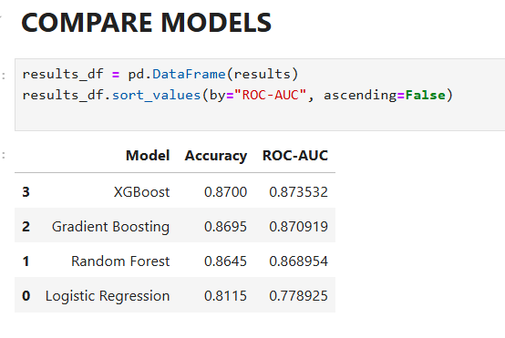
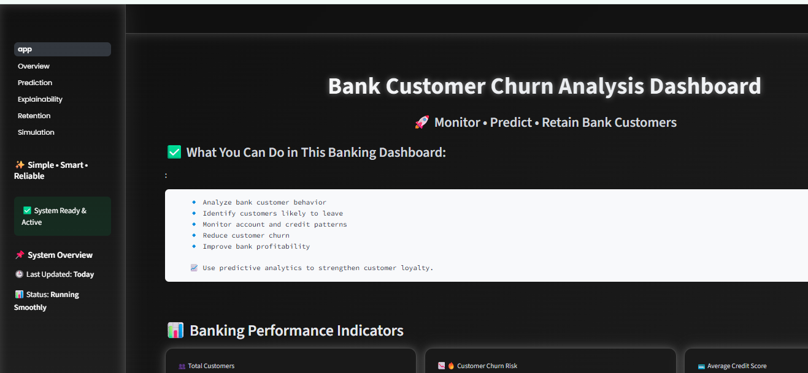
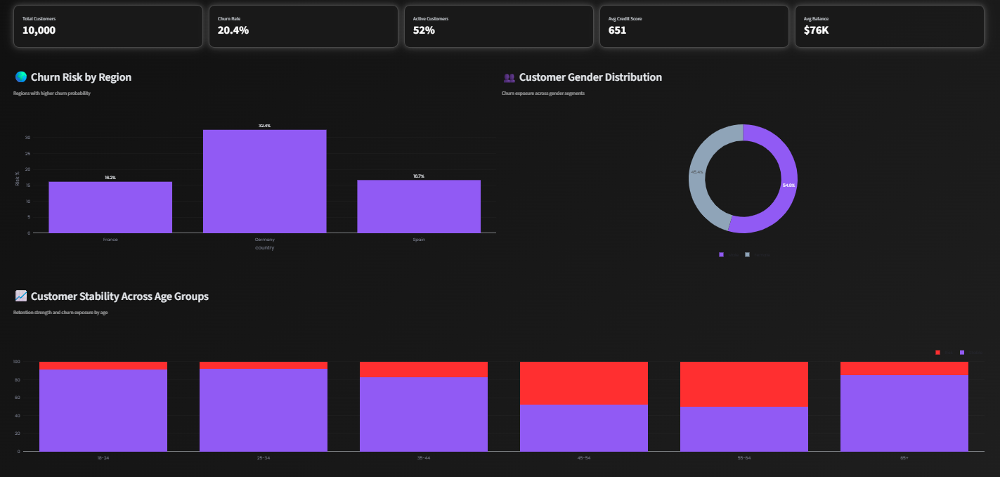
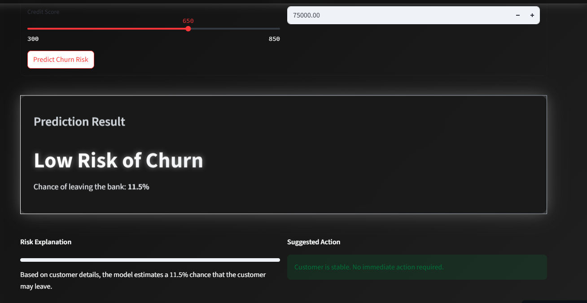
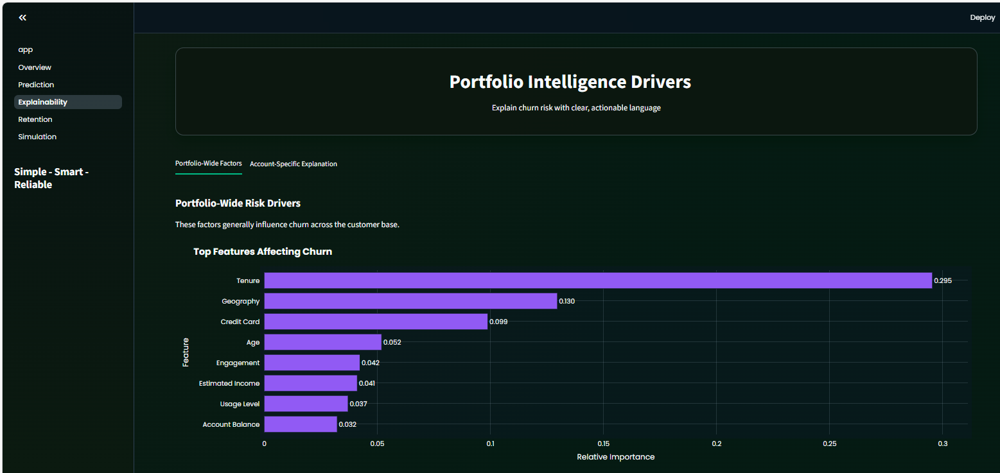
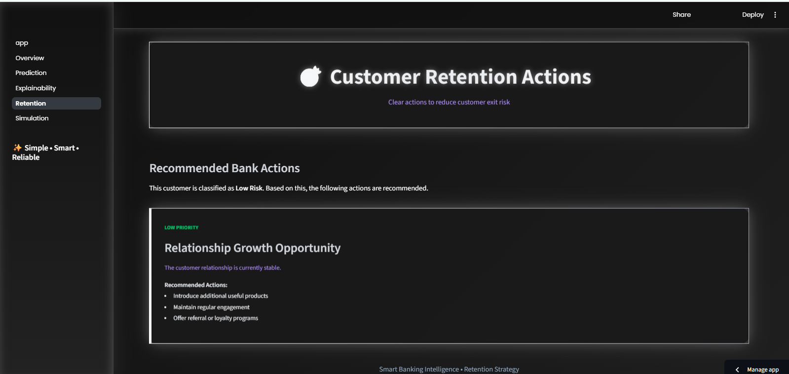
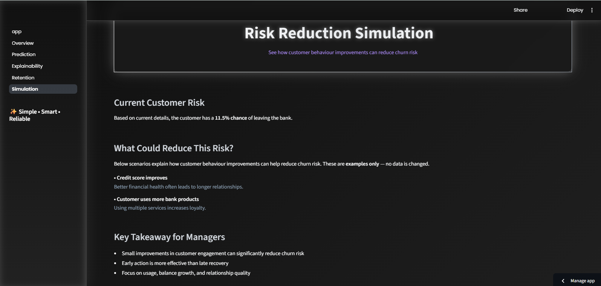
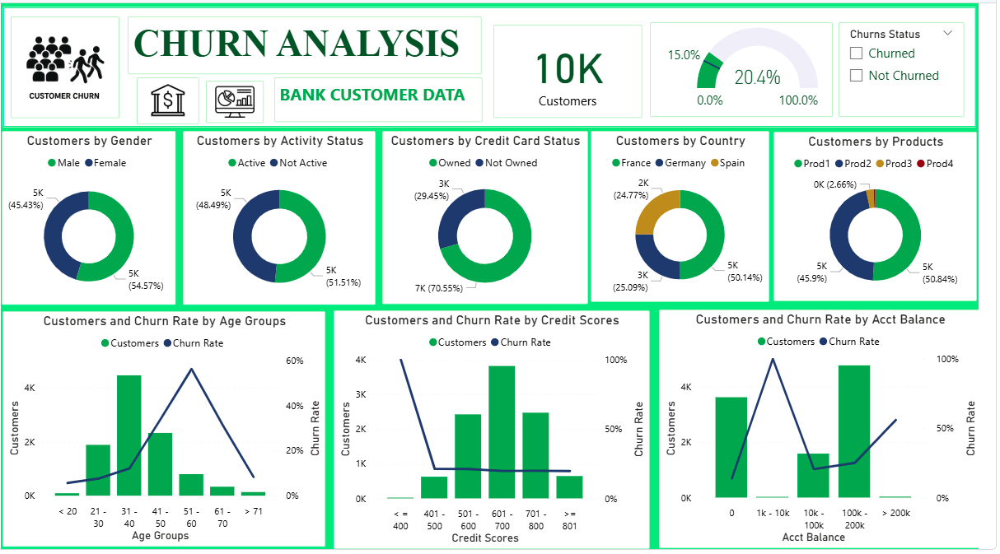

# Customer Churn Analysis & Prediction Dashboard

**End-to-End Customer Churn Analysis & Insights for Banking Sector (EDA + Power BI + Streamlit)**

An interactive project that combines **Exploratory Data Analysis (EDA)**, **Power BI dashboarding**, and a **Streamlit application** to analyze bank customer churn, predict churn risk, and provide actionable retention insights.

**Demo & Deployment Links:**

* Streamlit App: Streamlit App: [Click here to run the app](https://customerschurnproject-xxsz8nepmsdappw6uxf23cg.streamlit.app/)

# Table of Contents

1. [Project Overview](#project-overview)
2. [Objectives](#objectives)
3. [Features](#features)
4. [Installation](#installation)
5. [Run the Streamlit App](#run-the-streamlit-app)
6. [Project Structure](#project-structure)
7. [Dataset](#dataset)
8. [How the Model Works](#how-the-model-works)
9. [EDA & Power BI Dashboard](#eda--power-bi-dashboard)
10. [Screenshots](#screenshots)
11. [Key Insights](#key-insights)
12. [Acknowledgements & References](#acknowledgements--references)
13. [Contact](#contact)

# Project Overview

This project helps banks **understand and reduce customer churn** using data analysis and machine learning.

It combines:

* Interactive **Power BI dashboard** for business insights
* **Streamlit app** for real-time churn prediction and retention recommendations
* Explainable insights at both **portfolio-level** and **individual customer-level**

The trained machine learning model is stored in `models/churn_prediction_model.pkl` and uses `bank_churn.csv` dataset.

# Objectives

* Analyze customer churn behavior
* Identify key factors influencing churn
* Visualize churn trends across demographics and financial attributes
* Support **data-driven decision-making** for retention strategies

# Features

## Streamlit App Features

* Multi-page Streamlit dashboard
* Customer churn overview with KPIs and filters
* Real-time churn risk prediction for individual customers
* Risk classification: Low, Medium, High
* Explainability page to identify risk drivers
* Retention recommendations based on predicted risk
* Simulation page to show impact of behavior changes
* Custom UI styling (`assets/style.css`)

## Power BI Dashboard Features

* Total customers overview (10K customers)
* Churn analysis by **Gender, Country, Activity Status, Products, Credit Card Ownership**
* Churn trends by **Age, Credit Scores, and Account Balance**
* Interactive filters for churned vs non-churned customers
* Exportable visuals for business presentations

# Installation

## 1. Clone the repository

```bash
git clone <your-repo-url>
cd Customer_Churn_Project
````

## 2. Create a virtual environment

Windows (PowerShell):

```bash
python -m venv .venv
.venv\Scripts\Activate.ps1
```

Mac/Linux:

```bash
python -m venv .venv
source .venv/bin/activate
```

## 3. Install dependencies

```bash
pip install -r requirements.txt
```

## 4. (Optional) Confirm Python version

```text
python-3.11
```

# Run the Streamlit App

From the project root folder:

```bash
streamlit run app.py
```

Open the local URL shown in your terminal (usually `http://localhost:8501`).

# Project Structure

```text
Customer_Churn_Project/
├── assets/
│   └── style.css                     # Custom app styling
├── models/
│   ├── churn_prediction_model.pkl    # Trained ML model
│   └── customer_churn.ipynb          # Model training/EDA notebook
├── pages/
│   ├── 01_Overview.py                # KPIs, filters, and trends
│   ├── 02_Prediction.py              # Single-customer prediction
│   ├── 03_Explainability.py          # Risk driver explanations
│   ├── 04_Retention.py               # Retention recommendations
│   └── 05_Simulation.py              # Behavior-change simulation
├── utils/
│   ├── data_loader.py                 # Data & model helpers
│   └── ui_components.py               # Shared UI helpers
├── app.py                             # Streamlit main app
├── bank_churn.csv                     # Dataset
├── customer_churn_eda.ipynb           # EDA notebook
├── Customer_Churn_dashboard.pbix      # Power BI dashboard
├── Customer Churn Dashboard.pdf       # Dashboard export
├── requirements.txt                   # Dependencies
├── runtime.txt                        # Runtime version for deployment
└── README.md                           # Documentation
```

# Dataset

The project uses `bank_churn.csv` (10,000 rows, 12 columns).

## Main Columns

* `customer_id`: Unique identifier
* `credit_score`: Customer credit score
* `country`: Customer country
* `gender`: Customer gender
* `age`: Customer age
* `tenure`: Years with the bank
* `balance`: Account balance
* `products_number`: Number of bank products used
* `credit_card`: Has credit card (0/1)
* `active_member`: Active customer (0/1)
* `estimated_salary`: Estimated annual salary
* `churn`: Target (1 = churned, 0 = retained)

# Model Comparison

| Model               | Accuracy | ROC-AUC   |
|--------------------|----------|-----------|
| XGBoost             | 0.8700   | 0.873532  |
| Gradient Boosting   | 0.8695   | 0.870919  |
| Random Forest       | 0.8645   | 0.868954  |
| Logistic Regression | 0.8115   | 0.778925  |



# How the Model Works

1. Customer enters details on the **Prediction page**
2. The **preprocessing pipeline** transforms inputs
3. The model (`XGBClassifier`) predicts churn probability
4. Probability is mapped to risk labels:

   * `High`: > 0.60
   * `Medium`: 0.31–0.60
   * `Low`: ≤ 0.30
5. Results are displayed with **retention suggestions**


# EDA & Power BI Dashboard

* **Data Cleaning (Power Query):** Removed nulls/duplicates, renamed columns, calculated features

* **EDA (Python / Colab):**

  * Customer churn distribution
  * Gender vs Churn
  * Country vs Churn
  * Activity status vs Churn
  * Products used vs Churn
  * Age, Credit Score, Account Balance distributions
  * Correlation heatmaps

* **Power BI Dashboard:** Interactive charts, KPIs, and filters to analyze churn trends

# Screenshots

Place screenshots in `assets/` folder:

  
**App Home Page**

  
**Overview Page**

  
**Prediction Page**

  
**Explainability Page**

  
**Retention Page**

  
**Simulation Page**

  
**Power BI Dashboard**


Key Insights
------------

- Higher churn in **middle-aged customers**  
- Lower credit scores → higher churn risk  
- **Inactive customers** more likely to churn  
- Account balance significantly affects churn  
- Number of products and credit card ownership influence churn patterns  

---

Acknowledgements & References
-----------------------------

- [Streamlit](https://streamlit.io/)  
- [Pandas](https://pandas.pydata.org/)  
- [Scikit-learn](https://scikit-learn.org/)  
- [XGBoost](https://xgboost.readthedocs.io/)  
- [Plotly](https://plotly.com/python/)  
- [Power BI](https://powerbi.microsoft.com/)  

---

Contact
-------

- **Author:** Jyoti Gola  
- **Email:** [jyotigola439@gmail.com](mailto:jyotigola439@gmail.com)  
- **LinkedIn:** [https://www.linkedin.com/in/jyoti-gola-67251026a/](https://www.linkedin.com/in/jyoti-gola-67251026a/)  

```


